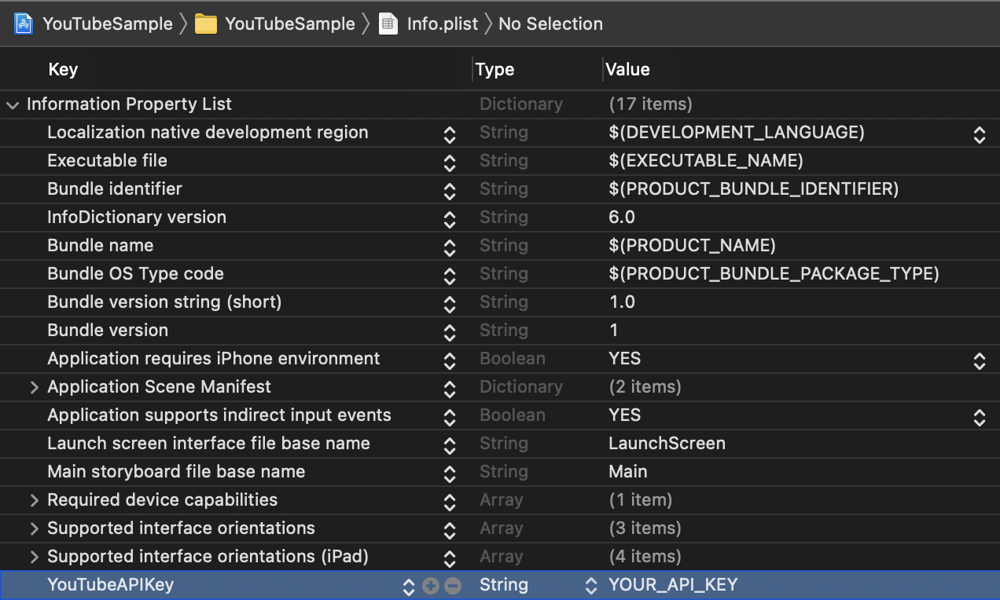

# YouTubeSampleWithMVP-DiffableDataSource

This is a YouTube like app sample with the Model-View-Presenter pattern.
It uses DiffableDataSource to display search view and detail view.


## Getting Started

Let's create you project on Google Cloud Platform and add an API Key to access [YouTube Data API v3](https://developers.google.cn/youtube/v3/getting-started?hl=en#before-you-start).
https://console.cloud.google.com/apis/credentials

If you could create an API key, add it to `Info.plist` as `YouTubeApiKey`.


## View Structure

`Detail.Item` relates to Views.

Detail.Item | View
:-: | :-:
.summary | DetailSummaryView
.channel | DetailChannelView
.description | DetailDescriptionView
.video | VideoView
.loading | LoadingView

`Detail.Item` is appended to [NSDiffableDataSourceSnapshot](https://developer.apple.com/documentation/uikit/nsdiffabledatasourcesnapshot) with any `Detail.Section` and reflects snapshot to UITableView.

```swift
enum Detail {
    enum Section: Hashable {
        case information
        case videos(segments: [VideoSegment])
        case loading
    }

    enum Item: Hashable {
        case summary(SummaryViewData)
        case channel(ChannelViewData)
        case description(String)
        case video(VideoViewData)
        case loading
    }
    ...
}

```

View | Snapshot
:-: | :-:
 | `stackView.axis = .vertical`

When you tap a triangle button on DetailSummaryView, `Item.descriptin` is inserted to bottom of `Section.information`. If that state is refrected to UITableView, it displays `DetailDescriptionView` with fade  animation.

View | Snapshot
:-: | :-:
 | `stackView.axis = .vertical`<br/>

When you rotate your device, `stackview.axis` is changed to `.horizontal`. The layout will change that left side is player, right side is UITableView.

View | Snapshot
:-: | :-:
 | `stackView.axis = .horizontal`<br/>

## Requirement

- Xcode 12.4
- iOS 14.1

## License

YouTubeSampleWithMVP-DiffableDataSource is available under the MIT license. See the [LICENSE](./LICENSE) file for more info.